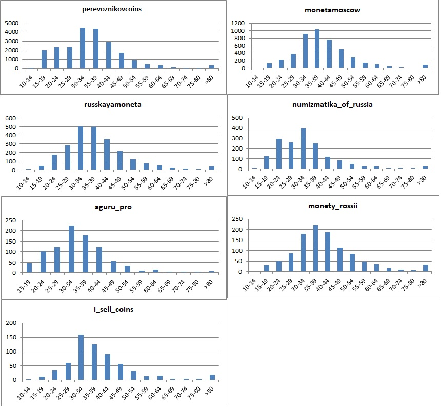
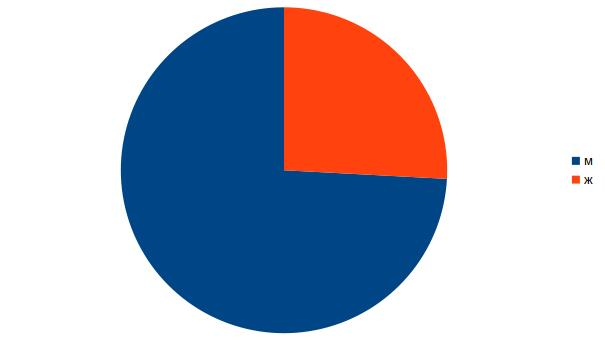

# Приложение для работы с коллекционными монетами

## Основной функционал
1. Пользователь может вести учет своей коллекции монет.
2. Админ может добавлять/изменять монеты в каталоге монет.
3. Пользователи могут обмениваться монетами друг с другом.
4. Пользователь может увидеть у кого есть недостающая монета и связаться с другим пользователем для обмена/продажи.
5. Пользователь может купить недостающую монету в магазине-партнере.

## Целевая аудитория
### Пользователь системы.
Целевую аудиторию пользователей системы определял анализируя различные сообщества нумизматов в VK. Был проведен анализ 
следующих VK групп:  
- aguru_pro
- numizmatika_of_russia
- perevoznikovcoins
- russkayamoneta
- monetamoscow
- monety_rossii
- i_sell_coins

Для определения целевой аудитории по возрасту было проанализировано 38334 пользователя. Были получены следующие данные:

Можно выделить возрастную группу 30-45 лет.

Распределение пользователей на основе пола
- Мужчины - 49187 (74,15%)
- Женщины - 17147 (25,85%)

Распределение по городам
- Москва - 17,79%
- Санкт-Петербург - 8,14%
- Казань - 2,02%
- Новосибирск - 1,66%
- Киев - 1,63%
- Нижний Новгород - 1,49%

### Магазин партнер
### Администратор системы

### *Боли* пользователей
- боли пользователей
    - обмен монет
    - отслеживать свою коллекцию.
      - Видеть каких монет не хватает до полной серии
    - покупать монеты
    - обмениваться монетами
- боли продавцов
  - реклама
  - база *горячих* пользователей
  - сложность разработки/поддержки собственного интернет магазина

### Статистика запросов